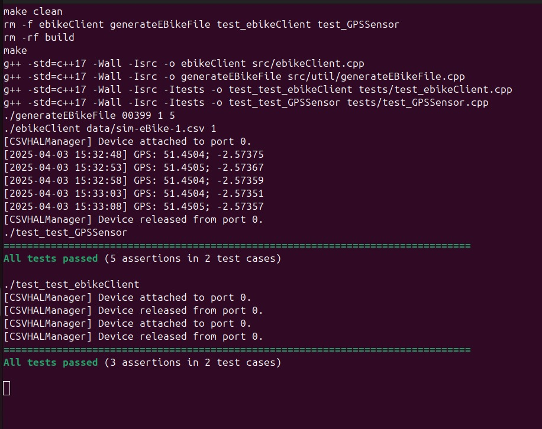

README
Development Process:
The first step to develop and test the simulated GPS sensor , was reviewing the assessment very well and get the specifications, and then to create the dirctories and its content as required in order to meet the structure requested the assessment.

The Development is splitted into three activitees(the third activity is this README document):
 Activity 1:(simulate GPS sensor)
 I implemented the GPS sensor(GPSSensor.h) class to simulate GPS sensor. in this class , two constructor are used, one for HAL usage(takes sesnor ID as parameter) and the another constructor for standalone testing( opens CSV file directly). the sensor have two methods one for formatting the data  as "latitude; longitude" after parsing the csv file and the other: readValue() which return the formatted form, And a destructor.
 
Second step was to implement the ebike Client program (ebikeClient.cpp) which parses a given csv file from the /data directory and display them as the required format with current timestamps.
The program loops data ends.

*Note: to generate csv file we should run the (generateEBikeFile.cpp) which is given in this assesment. to run this program we should use this command line :
./generateEBikeFile 00399 1 5    //./generateEBikeFile <seed> <num_files> <num_rows> (seed: last 5 digits of student ID)

**Note: to run the ebikeClient program (ebikeClient.cpp) we should use the following command line  (./ebikeClient <filename.csv> <staringID>).

Activity 2:(Unit testing using catch2 framework)
The GPSSensor test program have basic verfication for sensor ID(0) and Dimension(2) and also the ability to read and format gps data.

The ebikeClient test program verify that :  - proper reading and formatting of data . -behavior of CSVHALManager.
*Note:  in these both tests we assume that already we have a csv file of name "tests/test-gps.csv" which contains a GPS data and the tests are done by comparing to it.

Challenges and solutions:
The major challenge was reading and formatting data and i faced a big challenge with the ID which was initialised into 1 and becuase of that the reading caused an error exceeding nb of columns(more than 2) so i introduced a dummy column in the csv file as an initial solution(all set to 0)  by editing the generateEBikeFile.cpp, but then i solved this problem by decrementing the id in the ebikecleint before initializing the HAL, which also worked fine.

Learnings: 
-Hardware abstarction layers( HAL) and their role in IOT.
-OOP design and espacially multiple constructor to serve as different modes of operation.
-using of Catch2 to ensure code correctness.

Acknowledgements

Generate AI tool(chatgpt) was used for solving a main problem i had (ID problem discussed before), which served only as supportive tool when dealing with big errors.

